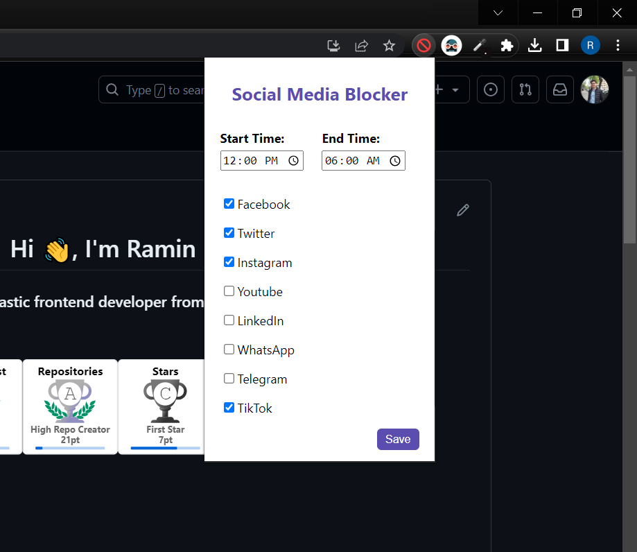

# Social Media Blocker Chrome Extension

The Social Media Blocker Chrome Extension allows you to block access to social media websites during specific time periods, helping you stay focused and increase productivity.

## Features

- Block access to popular social media websites such as Facebook, Twitter, Instagram, YouTube, LinkedIn, WhatsApp, Telegram, and TikTok.
- Set custom time limits to define the periods during which the websites will be blocked.
- Options page for easy configuration of time limits and selection of websites to block.
- Redirects blocked websites to a Google "Not Found" page.

## Installation

1. Clone or download this repository.
2. Open Google Chrome.
3. Enter `chrome://extensions` in the address bar.
4. Toggle on the "Developer mode" switch located in the top-right corner.
5. Click on "Load unpacked" and select the cloned/downloaded/src repository folder.
6. The Social Media Blocker extension will be added to your Chrome browser.

## Usage

1. Click on the extension icon in the Chrome toolbar to open the options page.
2. Set the start time and end time for the blocking period.
3. Check the social media websites you want to block.
4. Click "Save" to apply the settings.
5. During the specified time range, the selected social media websites will be blocked, and attempts to access them will be redirected to a Google "Not Found" page.

## Configuration

To change the time limits and blocked websites, follow these steps:

1. Click on the extension icon in the Chrome toolbar to open the options page.
2. Change the start time and end time for the blocking period.
3. Check or uncheck the social media websites you want to block.
4. Click "Save" to apply the settings.

## Customization

You can customize the "popup" by modifying the content of the `popup.html` file located in the src's folder. You can add your own HTML, CSS, and JavaScript code to create a personalized popup.

## License

This project is licensed under the MIT License - [MIT](https://choosealicense.com/licenses/mit/)
